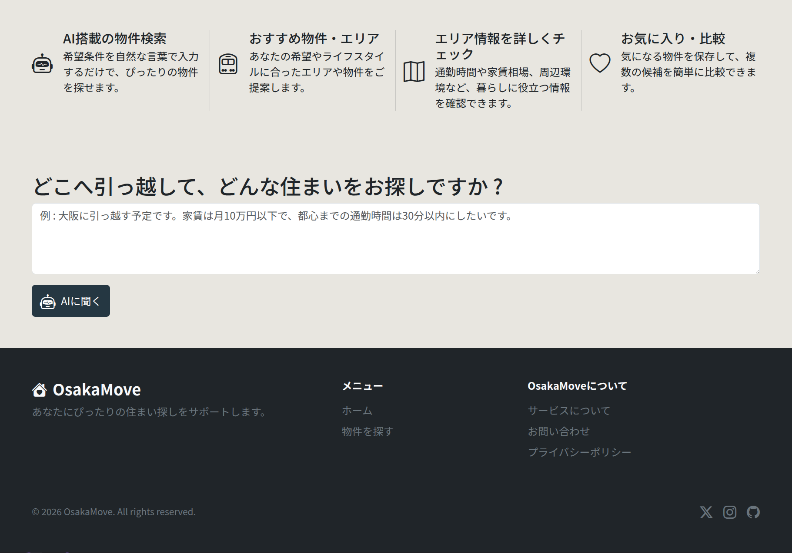
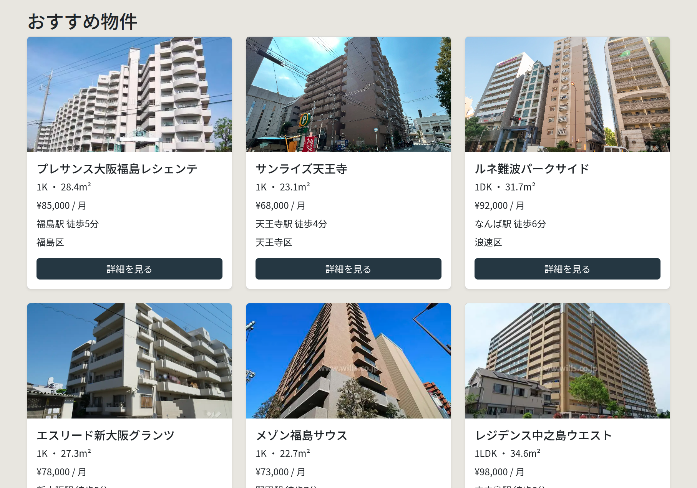
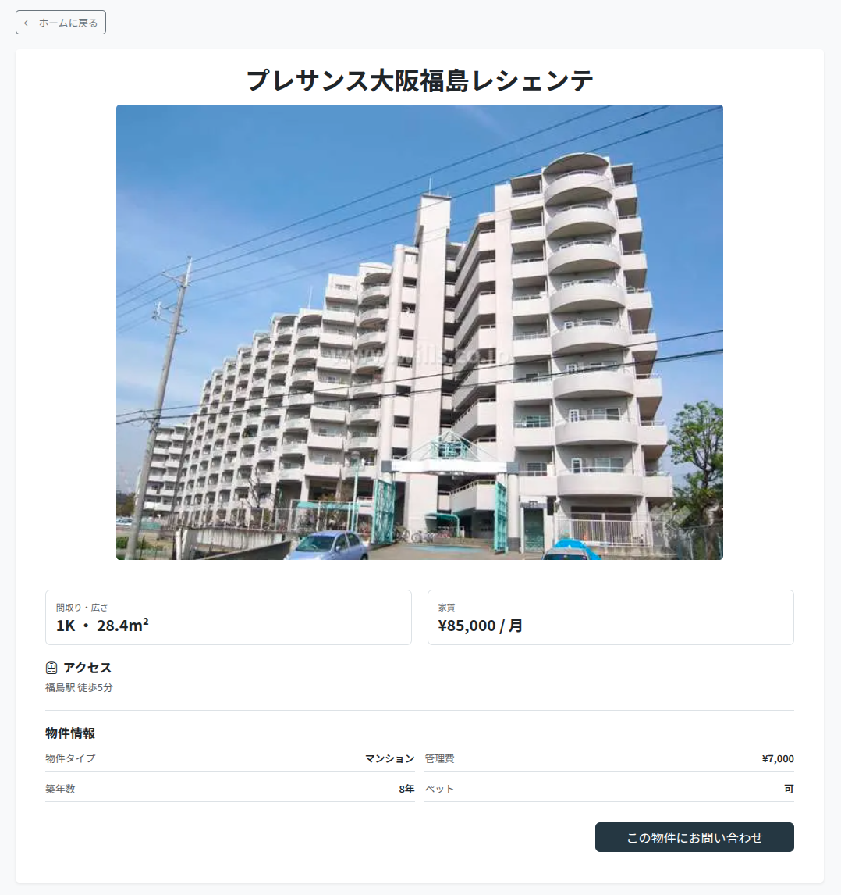

# OsakaMove 🏠

**AIを活用した大阪の物件検索アプリケーション**

OsakaMoveは、大阪への引っ越しを検討しているユーザーが、自然な言葉で希望条件を入力し、自分に合ったエリアと物件を探せるWebアプリケーションです。

ユーザーの入力をAIが分析し、大阪のおすすめエリアと物件検索条件を抽出。その結果をアプリケーション側の検索ロジックと組み合わせることで、登録されている物件の中から条件に合った物件を表示します。

## 📸 スクリーンショット






## ✨ 主な機能

### 🤖 AI引っ越しアシスタント

ユーザーは自然な文章で希望条件を入力できます。

> 「大阪に引っ越す予定です。家賃は月10万円以下で、駅から徒歩10分以内、25㎡以上のペット可の物件を探しています。」

AIが入力内容を分析し、

* おすすめのエリア
* 家賃の上限
* 最低専有面積
* ペット可否
* 駅までの最大徒歩時間

などの検索条件を構造化して取得します。

### 📍 大阪のエリア推薦

AIは大阪の地域情報を検索し、ユーザーの希望に合ったエリアを推薦します。

推薦されたエリアには、それぞれ以下の情報が含まれます。

* エリア名
* おすすめする理由
* エリアの適合度

### 🏠 条件に合った物件検索

AIが取得した条件をそのまま物件データに依存させるのではなく、アプリケーション側のTypeScriptロジックで実際の物件データをフィルタリングしています。

```text
ユーザーの入力
      ↓
     AI
      ↓
エリア・検索条件を構造化
      ↓
エリアによる物件検索
      ↓
検索条件によるフィルタリング
      ↓
おすすめ物件
```

AIが存在しない物件を生成するのではなく、OsakaMoveに登録された物件データのみを表示する構成にしています。

### 🏢 物件カード・詳細ページ

物件情報は再利用可能な `PropertyCard` コンポーネントとして実装しています。

物件カードから詳細ページへ移動でき、物件ごとの詳しい情報を確認できます。

### 📱 レスポンシブデザイン

Bootstrapを使用し、デスクトップ・タブレット・モバイルに対応しています。

## 🛠️ 使用技術

### Frontend

* React
* TypeScript
* Vite
* React Router
* Bootstrap
* Bootstrap Icons

### Backend

* Node.js
* Express
* CORS
* dotenv

### AI

* OpenAI API
* Responses API
* Web Search
* Structured Outputs

## 🧠 技術的なポイント

### AIとアプリケーションロジックの分離

OsakaMoveでは、AIに物件検索そのものを任せるのではなく、AIには**自然言語の理解とエリア推薦**を担当させています。

実際の物件検索・フィルタリングはTypeScriptで実装しています。

これにより、AIが架空の物件を生成することを防ぎ、アプリケーション内に存在する物件データのみをユーザーに提示できるようにしています。

### 構造化されたAIレスポンス

AIからの回答はJSON Schemaを使用して構造化しています。

例えば、以下のようなデータとしてアプリケーションに渡されます。

```text
{
  areas: [...],
  criteria: {
    maxRent: 100000,
    minSize: 25,
    petFriendly: true,
    maxWalkToStation: 10
  }
}
```

これにより、AIの自然言語による回答を、そのままUIに表示するだけではなく、アプリケーションの検索ロジックへ利用できるようにしています。

## 📂 プロジェクト構成

```text
osakamove/
├── public/
├── server/
│   └── index.ts
├── src/
│   ├── components/
│   ├── data/
│   ├── pages/
│   ├── types/
│   └── utils/
├── .env
├── .gitignore
├── package.json
└── README.md
```

## 🚀 ローカル環境での実行

### 1. リポジトリをクローン

```bash
git clone https://github.com/dicey44/osakamove.git
cd osakamove
```

### 2. パッケージをインストール

```bash
npm install
```

### 3. 環境変数を設定

プロジェクトのルートディレクトリに `.env` ファイルを作成し、OpenAI APIキーを設定します。

```text
OPENAI_API_KEY=your_api_key_here
```

**APIキーはGitHubなどの公開リポジトリにコミットしないでください。**

### 4. 開発サーバーを起動

フロントエンド：

```bash
npm run dev
```

バックエンド：

```bash
npm run server
```

フロントエンドは通常 `http://localhost:5173`、バックエンドは `http://localhost:3001` で起動します。

## 🎯 制作目的

このプロジェクトは、React / TypeScriptを中心としたフロントエンド開発に加え、バックエンドAPI、外部API、AI、構造化データ、検索ロジックなどを組み合わせたWebアプリケーション開発を実践することを目的として制作しました。

単純なAIチャットボットではなく、

**「AIによる自然言語の理解 → 構造化データ → アプリケーション側の検索・フィルタリング → 実際の物件表示」**

という一連の処理を実装しています。

## 📌 今後の改善予定

* 物件データの拡充
* 大阪のより詳細な地域情報の追加
* 外部APIを利用した地域情報の表示
* 物件検索・ソート機能の改善
* UI / UXのさらなる改善

---

**OsakaMove — 大阪での新しい暮らしを、より簡単に。**
